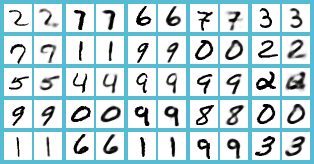
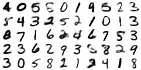
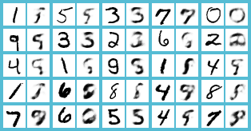
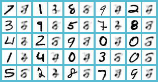

# Skewed auto-encoders

In a traditional neural auto-encoder, an input vector is compressed to a feature vector, and then the original input is reconstructed from that feature vector. In such a model, every component of the feature vector is equally "important"--there is no priority about which feature stores the most information. The goal of this project is to create a prioritized auto-encoder which generates skewed feature vectors (i.e. different components have different priorities).

# How it works

The idea is that an LSTM (or any RNN for that matter) learns to focus on recent inputs more than inputs in the distant past. As a result, feeding a large vector into an LSTM component-by-component naturally introduces a priority ordering: the inputs closer to the last input are the most "important" than the farther ones. We then use the output from the last time-step of the LSTM as the output from the skewed layer.

# Results

I trained an auto-encoder that compresses 28x28 MNIST digits to vectors with 30-components. The resulting reconstructions look like this:

Here is a neat animation of transitioning between digits in feature space:

Since this auto-encoder is meant to skew priority towards the later features, I tried doing some reconstructions with features 20-29 only (setting the remaining features to their means):

This still looks fairly good, even with 1/3 of the features. However, suppose we try to do the same thing with features 0-9:

Clearly, features 0-9 are not as powerful as features 20-29. However, somehow all 30 features come together to form decent reconstructions.
